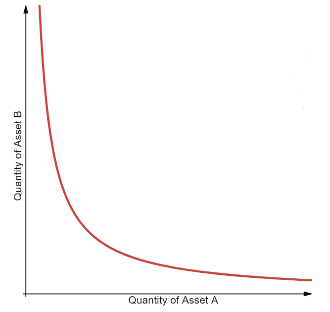

# AMM: Automated Market Makers

Nous avons vu dans le cours précédent que les `Automated Market Makers` sont une révolution dans la Blockchain et particulièrement dans les protocoles DeFi.  
Ils apportent une solution décentralisée pour des échanges de tokens en résolvant un problème majeur que peuvent rencontrer les exchanges: le manque de liquidité.

## Principles

L'`order book` est un mécanisme efficace pour matcher l'offre et la demande, mais il rencontre des frictions lorsqu'il s'applique aux exchanges de cryptomonnaies:

1. Techniquement difficile à mettre en oeuvre dans un exchange décentralisé
2. Dépend des market makers pour fluidifier le marché et la blockchain n'est pas un espace qui peut les intéressés. De plus toutes les transactions sont payantes et peuvent prendre du temps à être validées.
3. Il faut beaucoup de liquidité pour qu'un `order book` puisse montrer son intérêt, et un exchange décentralisé de par sa nature ne peut pas fonctionner avec des Fiat retirant ainsi un flot important de liquidité. Un exchange décentralisé ne peut lister que des cryptomonnaies avec beaucoup moins de liquidités que des exchanges "classiques" ou spécialisés en cryptomonnaies mais centralisés.

Le 22 juin 2017, Vitalik Buterin publie un article ou il décrit le concept des `Automated Market Maker`s qui inspirera de nos nombreux projets et protocoles DeFi.

Il y a plusieurs `AMM` ayant chacun leurs propres propres mécanismes (protocole) pour permettre des échanges décentralisés de tokens.  
Pour la suite de ce cours et pour décrire les propriétés d'un `AMM`, nous ne parlerons que des concepts fondamentaux d'un `AMM` dans sa version la plus simple, échanger des tokens via un `liquidity pool` constitué d'une paire d'assets.  
C'est la core feature d'`uniswap`.

Un `AMM` remplace les ordres d'achats et de ventes sur un exchange qui utilise un `order book` par un `liquidity pool` de deux actifs dont la valeur, de chacun de ces actifs, est relative l'un par rapport à l'autre.
Puisque qu'un asset est échangé contre un autre dans le pool de liquidité le prix relatif de ces assets change.  
Dans le cas d'un `liquidity pool` ETH/DAI, plus les ETH sont échangés contre des DAI, plus il y a d'ETH dans le pool et moins il y a de DAI. La conséquence serait une baisse du prix d'ETH en DAI et une augmentation du prix du DAI en ETH.

## protagonists

Trois acteurs fondamentaux interagissent sur le protocole d'un AMM tous dépendants les uns des autres.

### Liquidity providers

Les fournisseurs de liquidités.  
Ils apportent des liquidités dans un AMM en créant ou contribuant à un `liquidity pool`. Ils mettent à dispositions des traders leurs assets par paire (ETH/DAI, DAI/USDC, AAVE/MKR, ....).  
Les liquidity providers sont les moteurs de ces AMM et leurs participations est évidement récompensée par un pourcentage de tous les swaps effectués sur leurs `liquidity pool`.  
Cette activité n'est pas sans risque (`ìmpermanent loss`), justifiant ainsi leurs rewards basés sur les fees de tous les swaps sur le pool de liquidités auxquels ils contribuent.  
Les `liquidity providers` cherchent à obtenir le maximum de revenus par un maximum d'échanges effectués sur leurs pools par des traders.  
Leur contribution à un `liquidity pool` est déterminé par un `Liquidity Provider Token` (LP Tokens) qui est actuellement un NFT pour Uniswap V3, qui sera automatiquement généré pour chacun des contributeurs à un pool.  
Ce NFT contient comme information la [quantité](https://github.com/Uniswap/uniswap-v3-periphery/blob/main/contracts/NonfungiblePositionManager.sol#L45) déposée dans le pool permettant ainsi de calculer les fees récoltés pour l'owner de ce `LP Token` en fonction de sa participation. Si un liquidity provider contribue à un pool de liquidité à hauteur de 50%, il récupérera 50% de toutes les fees.

### Traders

Les traders sont les utilisateurs qui souhaitent échanger leurs cryptomonnaies contre une autre.  
Pour cela ils interagissent avec un pool de liquidité dont la paire de tokens les intéressent et effectuent l'échange d'une crypto contre l'autre de la pool.  
Pour cela ils doivent échanger un token qu'ils possèdent contre un token qu'ils souhaitent échanger.

### Arbitrors

Les arbitrors maintiennent le prix des actifs de ce pool conformément au prix du marché en échange de profits.
Lors de différents swaps successifs du même token d'une pool, la valeur relative de ce token par rapport à l'autre token de la pool peut se retrouver décorrélé du marché global créant ainsi des opportunités d'[Arbitrage](<https://fr.wikipedia.org/wiki/Arbitrage_(finance)>).  
Si dans notre pool ETH/DAI nous pouvons échanger 1 ETH contre 1500 DAI et que sur Binance 1 ETH vaut 1600 DAI, en échangeant 1500 DAI contre 1 ETH sur la pool, puis revendre 1 ETH sur Binance pour 1600 DAI nous devenons bénéficiaire de 100 DAI.  
Ce procédé se nomme L'`arbitrage` et il permet, en théorie, d'équilibrer les valeurs des assets sur les pools.

## Liquidity pool

### Fundamentals

La `liquidity pool` est le pilier des AMM et un actuellement élément essentiel de tous les protocoles de DeFi.  
Les pools de liquidités sont des smart contracts qui permettent les interactions essentielles suivantes:

- Créer un `liquidity pool` avec une certaine quantités de 2 assets
- Ajouter de la liquidité à un pool déjà existant
- Récupérer ses liquidités d'un pool déjà existant (se retirer du pool)
- Echanger un token contre un autre, on parle de `swap`.

le prix relatif des tokens de ce pool est déterminé automatiquement par la fonction `Constant Product Market Maker`. Une fonction qui est exprimée par la formule: `x * y = k`.

### Creating a liquidity pool

La création d'un liquidity pool est une étape importante car c'est lors de la création du pool, c'est à dire au premier deposit des assets, que le `price of the pool` est déterminé.  
Le prix est exprimé pour une `currency pair` ou la valeur indique le nombre de `quote currency` nécéssaire pour acheter une unité de la `base currency`.  
Par exemple `Token1/Token2 = 3.17` signifie que 1 unité de la `base currency` Token1 vaut 3.17 de la `quote currency` Token2.  
Si on inverse la paire: `Token2/Token1 = 0.315` signifie que 1 unité de la `base currency` Token2 faut 0.315 de la `quote currency` Token1.  
Ainsi à la création du pool il est vivement recommandé de déposer une quantité de chacune des pairs pour qu'elles aient la même valeur.  
Donc si on suit l'exemple précédent si on dépose 1000 Token1 dans la pool il faudra que l'on dépose également 3170 Token2. En effet si le `liquidity provider` ne respecte pas les prix du marché il va créer une opportunité d'arbitrage qui pourra être immédiatement exploité par des acteurs externes.  
Une fois les 2 assets déposés dans la pool, les traders peuvent échanger l'un ou l'autre des tokens de la paire, avec le prix automatiquement calculé grâce à la `Constant Function Market Maker`.

### Constant Function Market Maker

Il existe plusieurs types de `Constant Function Market Maker`, la plus popularisé par `Uniswap` est la `Constant Product Market Maker`.  
Le prix relatifs des actifs de la pool est déterminé par un produit des quantités des assets de la pool qui est constant.  
La `Constant Product Market MAker` est exprimé par: `x * y = k`.

- `x` quantité du premier asset
- `y` quantité du deuxième asset
- `k` une valeur constante qui correspond au produit des 2 assets

La courbe d'une CPMM:

### Exercice

Créer un smart contract qui gérera un pool de liquidité.
Ce pool de liquidité vide initialement permettra les swap entre 2 tokens ou 1 tokens et de l'Ether selon votre choix.

- Une fonction `deposit` permettra d'initialiser la pool de liquidité avec une paire de 2 tokens (on ne peut initialiser le pool qu'une fois), celui qui effectue le deposit devient l'owner de la pool.
- Une fonction `removeLiquidity` permettra à l'owner de récupérer ses tokens déposés dans le pool de liquidité
- une fonction `swap` permettra à un trader d'échanger ses tokens sur la pool en fonction d'une `Constant Product Market Maker`.
- Ne pas prendre en compte les `fees` pour cet exercice.
